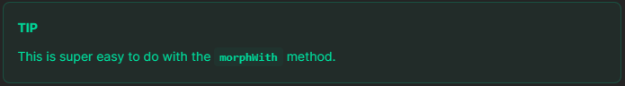

# Laravel Nested Eager Loading on Polymorphic Relationships

Sometimes you need to eager load different relationships depending on the type of model on a polymorphic relationship.



For example: you have two type of users `seller` and `buyer`, the eager load relationship for `seller` is the `product` and the eager load relationship for `buyer` is the `order`.

* First setup the Models.

```php
class Seller extends Model
{
    public function products()
    {
        return $this->hasMany(Product::class);
    }
}
```

```php
class Buyer extends Model
{
    public function orders()
    {
        return $this->hasMany(Order::class);
    }
}
```

```php
class Profile extends Model
{
    public function user()
    {
        return $this->morphTo();
    }
}
```

* Then load the relations like the following:

```php
Profile:with('user', function (MorphTo $morphTo) {
    // Eager load the products for seller.
    // Eager load the orders for buyer 👇
    $morphTo->morphWith([
        Seller::class => ['products'],
        Buyer::class => ['orders'],
    ]);
})->get();
```
